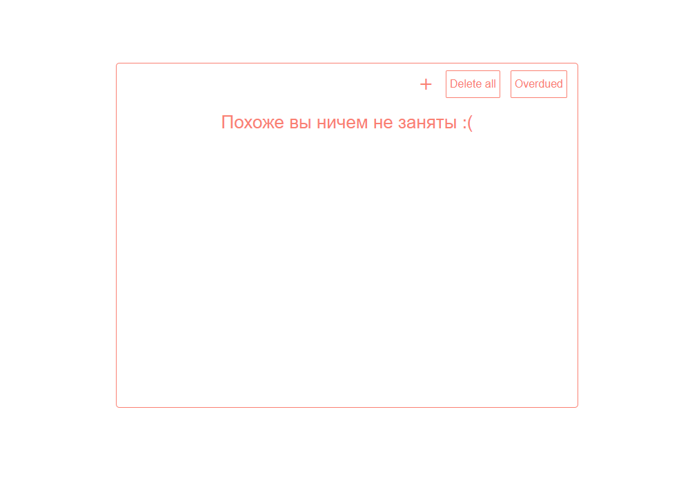

# Todos-React-App 

Приложение, созданное surpri6e, начинающим разработчиком на React. У данного приложения удобный интерфейс, большой функционал, а также постоянная стабильность и постоянное наличие обновлений. Чтобы перейти к самому прилжению необходимо перейти по ссылке - [Todo's by surpri6e](https://todosbysurpri6e.vercel.app/).

**Начальная страница**

В дальнейшем, можно разобраться интуитивно, т.к. интерфейс невероятно прост.

1. **Кнопка создания** - открывает меню настройки.
2. **Меню настройки** - позволяет выбрать текст самой задачи, её примечание, срок выполнения.
3. **Удальнить все** - соответственно удаляет весь список задач
4. **Круг возле списка** ->

    4.1. **При одном клике** - *выполняет* необходимое действие, но не УДАЛЯЕТ его, это нужно, к примеру, если у вас много повторяющихся действий, чтобы каждый раз их не создавать.
    
    4.2. **При двойном клике** - именно что удаляет данную задачу.
5. **Просроченные** - если вы поставили себе ограничение для задачи, но не успели выполнить, она окажется в другом списке, который также при необходимости можно очистить.

***В скором времени будет добавлен новый функционал, пример, группировка задач на определенные категории.***

## Licence

В проекте вшита MIT лицензия, просмотреть её можно - [вот здесь](./LICENSE)

created by *sursy comp*